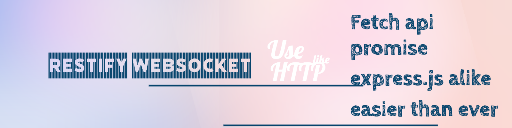

<h1 align="center">Soxtend</h1>

Easiest Websocket library for big projects

## Why Another Library?

1. Is event based system(.emit/.on) too basic to meet your app needs making development slow?
1. Do you want to wait for server response while sending websocket message with ease?
1. Do you want to use react-query with websockets?
1. Do you want to deploy to multi-node cluster with ease using Redis without doing anything extra? (Coming Soon!)

## Introduction

`restify-websocket` provides a very lightweight HTTP similar API for using Websockets in Node/Browser. WebSocket code often gets confusing because of generic `.on` and `.emit` events. While HTTP model has REST standard for CRUD, Websockets have nothing more than socket.io(rooms, namespaces). This library provides:

1. Connect, reconnect functionality out of the box. You just start sending messages and we take care of rest.
1. If you are familiar with ExpressJS then this library you already know with few exceptions.
1. Send Request from Browser like Fetch API and get promise in return

## Examples

### HTTP Get-like Request

    // Browser
    export const { client, receiver, socket } = new RestifyWebSocket(SERVER_URL)
    // Request, just like HTTP(axios)
    const response = await client.get('/users/123', {
      body
    })
    console.log(response.data)

    // Websocket Server, just like express
    const { clients, router, server } = new RestifyWebSocket.Server()
    router.get('/users/:userId', (req, res) => {
      const userId = req.params.userId
      const user = {
        userId
      }
      res.status(200).send(user)
    })

### Sending data from Server

Many times this happens that Websocket server sends data to Browser without being requested by Browser. For that case, receivers are available.

    // BROWSER
    export const { client, receiver, socket } = new RestifyWebSocket(SERVER_URL)
    receiver.get('/stocks/:companyName', (request, response) => {
      console.log(response.data)
    })

    // SERVER
    const { clients, router, server } = new RestifyWebSocket.Server()
    clients.find('*').get('/stocks/goldman-sachs', {
      data: [1, 2, 3] // it is not body, like typical fetch, because we are sending for browser
    })

### Multiple Tabs Communication

If user is opening from multiple tabs and you want to update each tab, since this is a normal real-time application requirement

    const { clients, router, server } = new RestifyWebSocket.Server()
    router.patch('/users/:userId', (req, res) => {
      const userId = req.params.userId
      const user = // change user in DB
      res.groupedClients.status(200).send(user) // will send to all sockets belongin to a group
      res.send(user)  // This will send to current tab only that made the update request
    })

For the above request, you will need a receiver since many tabs did not ask for this update

    // Other tabs
    export const { client, receiver, socket } = new RestifyWebSocket(SERVER_URL)
    receiver.patch('/users/:userId', (request, response) => {
      console.log(response.data)
    })

Meanwhile the tab that made the request in the first place will also get the acknowledgment of update fulfilled

    // Tab that is making the user update request
    export const { client, receiver, socket } = new RestifyWebSocket(SERVER_URL)
    const { data } = await client.patch('/users/123', {
      body: {
        newName: 'james'
      }
    }
    console.log(data) // Generally you dont want data here, since the receiver will also get the data for you.

### Multiple Tabs Warning like Whatsapp

    const { clients, router, server } = new RestifyWebSocket.Server()
    router.get('/users/:userId', (req, res) => {
      const userId = req.params.userId
      const user = // change user in DB
      res.othersInGroup.status(400).send("Please Close this Tab as you are open from another tab")
      res.send(user)  // This will send to current tab with the user info
    })

### With react-query

Coming soon!
